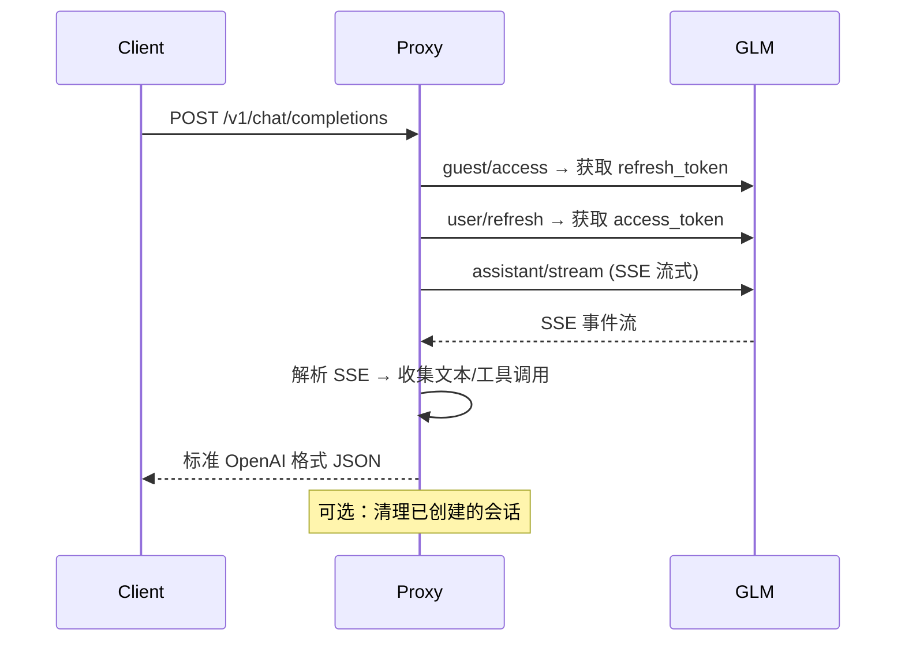

# GLM 模型调用接入指南

> 基于深度分析，整理出完整的 GLM（智谱清言）模型调用方案，可直接用于集成到其他项目中。

---

## 目录

- [1. 整体架构](#1-整体架构)
- [2. 认证体系详解](#2-认证体系详解)
- [3. 完整请求流程](#3-完整请求流程)
- [4. API 端点与数据格式](#4-api-端点与数据格式)
- [5. 流式响应处理](#5-流式响应处理)
- [6. 高级功能](#6-高级功能)
- [7. 多协议适配](#7-多协议适配)
- [8. 快速集成示例](#8-快速集成示例)
- [9. 常见问题](#9-常见问题)

---

## 1. 整体架构

```
┌─────────────┐     ┌──────────────────┐     ┌────────────────────┐
│  客户端应用  │────▶│   GLM API 代理    │────▶│  chatglm.cn 后端    │
│ (任意语言)   │◀────│ (你的集成层)      │◀────│  (GLM 服务端)       │
└─────────────┘     └──────────────────┘     └────────────────────┘
                           │
                    ┌──────┴──────┐
                    │  Token 缓存  │
                    │ (Cache API) │
                    └─────────────┘
```

### 核心流程分层

| 层级 | 组件 | 说明 |
|------|------|------|
| **认证层** | 签名生成 + Token 获取 | 每次请求前获取或刷新 token |
| **通信层** | HTTP 请求 + SSE 流式解析 | 与 `chatglm.cn` 后端通信 |
| **转换层** | 协议适配器 | OpenAI/Claude/Gemini 格式互转 |

---

## 2. 认证体系详解

GLM API 采用**三层 Token 体系**：

```
游客凭证(无) ──▶ Refresh Token ──▶ Access Token
   (长期)              (长期)           (1小时有效)
```

### 2.1 第一步：获取访客 Refresh Token

**端点：** `POST https://chatglm.cn/chatglm/user-api/guest/access`

**请求体：** `{}`

#### 签名算法

```javascript
// 1. 构建时间戳（带校验和）
const now = Date.now().toString();
const digits = now.split("").map(Number);
const checksum = (digits.reduce((a, b) => a + b, 0) - digits[digits.length - 2]) % 10;
const timestamp = now.substring(0, now.length - 2) + checksum + now.substring(now.length - 1);

// 2. 生成随机 nonce
const nonce = crypto.randomUUID().replace(/-/g, "");

// 3. 计算签名 (MD5)
const sign = MD5(`${timestamp}-${nonce}-${SIGN_SECRET}`);
// SIGN_SECRET 默认值: "8a1317a7468aa3ad86e997d08f3f31cb"
```

#### 完整请求头

```
POST https://chatglm.cn/chatglm/user-api/guest/access
Content-Type: application/json;charset=utf-8
App-Name: chatglm
X-Device-Id:  <随机 UUID, 无连字符>
X-Request-Id: <随机 UUID, 无连字符>
X-App-Platform: pc
X-App-Version: 0.0.1
X-App-fr: browser
X-Lang: zh-CN
X-Exp-Groups: ""
X-Device-Model: ""
X-Device-Brand: ""
X-Timestamp:  <签名时间戳>
X-Nonce:      <随机 nonce>
X-Sign:       <MD5 签名>
```

#### 成功响应

```json
{
  "status": 0,
  "result": {
    "refresh_token": "eyJ...",
    "access_token": "eyJ...",
    "user_id": "xxx"
  }
}
```

### 2.2 第二步：通过 Refresh Token 获取 Access Token

**端点：** `POST https://chatglm.cn/chatglm/user-api/user/refresh`

**请求头：**

```
POST https://chatglm.cn/chatglm/user-api/user/refresh
Authorization: Bearer <refresh_token>
Content-Type: application/json
X-Device-Id:  <随机 UUID>
X-Request-Id: <随机 UUID>
X-Timestamp:  <签名时间戳>
X-Nonce:      <随机 nonce>
X-Sign:       <MD5 签名>
...其他浏览器头（User-Agent、Referer 等）
```

> 此接口的签名算法与 2.1 节完全相同，使用同一个 `SIGN_SECRET`。

#### 成功响应

```json
{
  "code": 0,
  "result": {
    "access_token": "eyJ...",
    "refresh_token": "eyJ...（可能更新）"
  }
}
```

### 2.3 Token 缓存策略

Access Token 有效期约为 **3600 秒（1 小时）**，建议如下策略：

```
┌─────────────┐
│ 发起请求     │
└──────┬──────┘
       ▼
┌──────────────────────┐
│ 检查缓存中 access    │──── 有(未过期) ──▶ 直接使用
│ token 是否有效       │
└──────┬───────────────┘
       │ 无/过期
       ▼
┌──────────────────────┐
│ 使用 refresh_token   │
│ 调用 refresh 接口     │──── 成功 ──▶ 缓存新 token
└──────┬───────────────┘
       │ 40102 错误
       ▼
┌──────────────────────┐
│ 重新获取 guest       │
│ refresh_token        │
└──────────────────────┘
```

#### 核心实现要点

```typescript
const tokenRequestQueues: Record<string, Array<(result: any) => void>> = {};

async function acquireToken(refreshToken: string): Promise<string> {
  // 1. 尝试从缓存获取
  const cached = await getCachedAccessToken(refreshToken);
  if (cached) return cached;

  // 2. 请求队列去重（同一 refreshToken 的并发请求合并）
  const tokenData = await requestToken(refreshToken);

  // 3. 写入缓存
  await setCachedAccessToken(refreshToken, tokenData.accessToken, tokenData.refreshTime);
  return tokenData.accessToken;
}
```

---

## 3. 完整请求流程

### 3.1 对话补全流程



### 3.2 核心 API 调用

**端点：** `POST https://chatglm.cn/chatglm/backend-api/assistant/stream`

#### 请求体结构

```json
{
  "assistant_id": "65940acff94777010aa6b796",
  "conversation_id": "",
  "project_id": "",
  "chat_type": "user_chat",
  "messages": [
    {
      "role": "user",
      "content": [
        { "type": "text", "text": "你好，请介绍一下你自己" },
        { "type": "file", "file": [... 文件引用 ...] },
        { "type": "image", "image": [... 图片引用 ...] }
      ]
    }
  ],
  "meta_data": {
    "channel": "",
    "chat_mode": "",
    "draft_id": "",
    "if_plus_model": true,
    "input_question_type": "xxxx",
    "is_networking": true,
    "is_test": false,
    "platform": "pc",
    "quote_log_id": "",
    "cogview": {}
  }
}
```

#### 关键参数说明

| 参数 | 说明 | 默认值 |
|------|------|--------|
| `assistant_id` | 模型/应用 ID（24 位 hex） | `65940acff94777010aa6b796`（通用对话） |
| `conversation_id` | 续传时传入已有 ID | 空字符串 = 新对话 |
| `chat_mode` | 特殊模式：`zero`/`deep_research` | 空串 = 普通模式 |
| `if_plus_model` | 是否启用增强模型 | `true` |
| `is_networking` | 是否开启联网搜索 | `true` |

### 3.3 消息格式转换

用户传入的消息数组需经过两步处理：

#### Step 1：工具调用转换（`convertToolMessages`）

| 原始 role | 转换后 | 说明 |
|-----------|--------|------|
| `tool` | `user` | 将工具返回结果用自然语言包装 |
| `assistant`（含 `tool_calls`） | `assistant` + 描述文本 | 让模型看到调用历史 |

#### Step 2：消息合并（`messagesPrepare`）

将多轮对话合并为单条 user 消息，格式为：

```
<|user|>
用户消息1
<|assistant|>
AI回复1
<|user|>
用户消息2
<|assistant|>
```

---

## 4. API 端点与数据格式

### 4.1 OpenAI 兼容格式

### 4.2 Claude 兼容

### 4.3 Gemini 兼容

## 5. 流式响应处理

---

## 6. 高级功能

### 6.1 Tool Calling（函数调用）

#### 注入工具
 
### 6.2 文件上传

**端点：** `POST https://chatglm.cn/chatglm/backend-api/assistant/file_upload`

```javascript
async function uploadFile(fileUrl, refreshToken) {
  // 1. 获取文件二进制数据（支持 base64 data URL 或 http URL）
  let fileData, filename, mimeType;

  if (isBASE64Data(fileUrl)) {
    // base64 内嵌数据
    fileData = base64ToArrayBuffer(removeHeader(fileUrl));
    filename = `${uuid()}.${extension}`;
  } else {
    // 远程 URL
    filename = basename(fileUrl);
    const res = await fetch(fileUrl);
    fileData = await res.arrayBuffer();
  }

  // 2. 构建 FormData
  const formData = new FormData();
  formData.append("file", new Blob([fileData], { type: mimeType }), filename);

  // 3. 上传
  const token = await acquireToken(refreshToken);
  const response = await fetch(uploadUrl, {
    method: "POST",
    headers: { Authorization: `Bearer ${token}` },
    body: formData,
  });

  // 4. 返回结果（含 source_id）
  return result;
}
```

#### 文件限制

| 限制项 | 值 |
|--------|-----|
| 最大文件大小 | 100 MB (`FILE_MAX_SIZE`) |

### 6.3 图像生成

```javascript
async function generateImages(prompt, refreshToken) {
  // 使用 CogView 模型
  const model = "65a232c082ff90a2ad2f15e2";
  const messages = [{ role: "user", content: prompt.indexOf("画") == -1 ? `请画：${prompt}` : prompt }];

  // 调用 assistant/stream，从 SSE 中提取 image_url
  const response = await glmPostStream(
    "https://chatglm.cn/chatglm/backend-api/assistant/stream",
    { assistant_id: model, messages: prepareMessages(messages), meta_data: { ... } },
    headers,
  );

  // 解析流，提取所有 image_url
  const { imageUrls } = await receiveImages(response.body);
  return imageUrls;
}
```

### 6.4 视频生成

```javascript
async function generateVideos(prompt, refreshToken, options) {
  // 1. 可选：先使用 CogView 生成参考图
  let sourceList = [];
  if (options.imageUrl) {
    const uploadResult = await uploadFile(options.imageUrl, refreshToken, true);
    sourceList.push(uploadResult.source_id);
  }

  // 2. 发起视频生成请求
  const resp = await fetch("https://chatglm.cn/chatglm/video-api/v1/chat", {
    method: "POST",
    headers: { Authorization: `Bearer ${token}`, ...headers },
    body: JSON.stringify({
      prompt,
      source_list: sourceList,
      advanced_parameter_extra: {
        video_style: options.videoStyle,           // 卡通3D/黑白老照片/油画/电影感
        emotional_atmosphere: options.emotionalAtmosphere,  // 温馨和谐/生动活泼/紧张刺激/凄凉寂寞
        mirror_mode: options.mirrorMode,           // 水平/垂直/推近/拉远
      },
    }),
  });

  // 3. 轮询状态（最多 600 秒）
  while (true) {
    const statusResp = await fetch(`https://chatglm.cn/chatglm/video-api/v1/chat/status/${chatId}`, {
      headers: { Authorization: `Bearer ${token}`, ...headers },
    });
    const { status, video_url } = statusResp.result;
    if (status === "finished") return video_url;
    if (status !== "init" && status !== "processing") throw new Error("生成失败");
    await sleep(1000);
  }
}
```

### 6.5 重试机制

```javascript
const MAX_RETRY_COUNT = 3;
const RETRY_DELAY = 5000; // 5 秒

async function withRetry(fn, retryCount = 0) {
  try {
    return await fn();
  } catch (err) {
    if (retryCount < MAX_RETRY_COUNT) {
      console.error(`Retry ${retryCount + 1}/${MAX_RETRY_COUNT}: ${err.message}`);
      await sleep(RETRY_DELAY);
      return withRetry(fn, retryCount + 1);
    }
    throw err;
  }
}
```

---

## 7. 多协议适配

项目实现了三种主流 API 格式的适配，方便使用不同 SDK 的客户端直接接入。

### 7.1 路由映射

| 客户端协议 | 入口路由 | 转换方向 |
|-----------|---------|---------|
| OpenAI | `POST /v1/chat/completions` | 直接使用 GLM 内部格式 |
| Claude | `POST /v1/messages` | Claude → GLM → Claude |
| Gemini | `POST /v1beta/models/...:generateContent` | Gemini → GLM → Gemini |

### 7.2 Claude 适配器转换

```javascript
// Claude → GLM
function convertClaudeToGLM(messages, system) {
  // system → 追加到 system role
  // user content (含 tool_result) → user message
  // assistant content (含 tool_use) → assistant message（JSON 工具调用格式）
}

// GLM → Claude（非流式）
function convertGLMToClaude(glmResponse) {
  // OpenAI format {
  //   choices[0].message.content
  //   choices[0].message.tool_calls
  //   choices[0].finish_reason
  // } → Claude format {
  //   type: "message"
  //   content: [{ type: "text"|"tool_use", ... }]
  //   stop_reason: "end_turn"|"tool_use"
  // }
}

// GLM → Claude（流式）
function convertGLMStreamToClaude(glmStream) {
  // OpenAI SSE delta → Claude SSE events:
  //
  // message_start
  //   → 发送 event: message_start
  // content_block_start (text)
  //   → 发送 event: content_block_start { type: "text" }
  // content_block_delta (text_delta)
  //   → 发送 event: content_block_delta { delta: { text } }
  // content_block_stop (text)
  // content_block_start (tool_use)
  //   → 发送 event: content_block_start { type: "tool_use", id, name }
  // content_block_delta (input_json_delta)
  //   → 发送 event: content_block_delta { delta: { partial_json } }
  // content_block_stop (tool_use)
  // message_delta → message_stop
}
```

### 7.3 Gemini 适配器转换

```javascript
// Gemini → GLM
function convertGeminiToGLM(contents, systemInstruction) {
  // contents[].role: "model" → "assistant"
  // contents[].role: "user"  → "user"
  // systemInstruction 合并到第一条 user 消息
}

// GLM → Gemini
function convertGLMToGemini(glmResponse) {
  return {
    candidates: [{
      content: { parts: [{ text: glmResponse.choices[0].message.content }], role: "model" },
      finishReason: glmResponse.choices[0].finish_reason === "stop" ? "STOP" : "MAX_TOKENS",
    }],
    usageMetadata: { ... },
  };
}
```

## 附录：核心常量与默认值

| 常量 | 值 | 说明 |
|------|-----|------|
| `SIGN_SECRET` | `8a1317a7468aa3ad86e997d08f3f31cb` | 签名密钥 |
| `DEFAULT_ASSISTANT_ID` | `65940acff94777010aa6b796` | 默认对话模型 |
| `ACCESS_TOKEN_EXPIRES` | `3600` | Token 过期时间（秒） |
| `MAX_RETRY_COUNT` | `3` | 最大重试次数 |
| `RETRY_DELAY` | `5000` | 重试间隔（毫秒） |
| `FILE_MAX_SIZE` | `100 * 1024 * 1024` | 文件上传大小限制（字节） |
| `guests/access` | `https://chatglm.cn/chatglm/user-api/guest/access` | 获取访客 token |
| `user/refresh` | `https://chatglm.cn/chatglm/user-api/user/refresh` | 刷新 access token |
| `assistant/stream` | `https://chatglm.cn/chatglm/backend-api/assistant/stream` | 核心对话接口 |
| `file_upload` | `https://chatglm.cn/chatglm/backend-api/assistant/file_upload` | 文件上传 |
| `video/chat` | `https://chatglm.cn/chatglm/video-api/v1/chat` | 视频生成 |
| `video/status` | `https://chatglm.cn/chatglm/video-api/v1/chat/status/{chatId}` | 视频状态轮询 |

---
